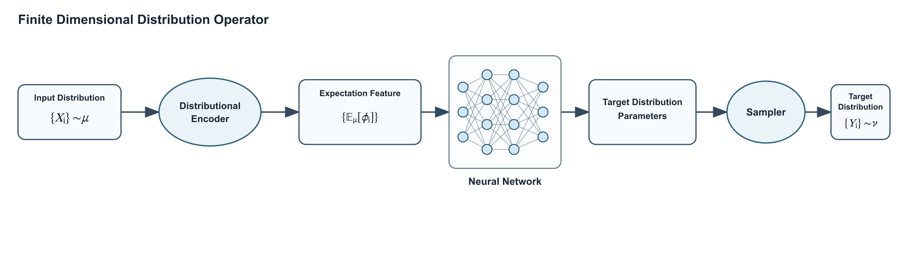
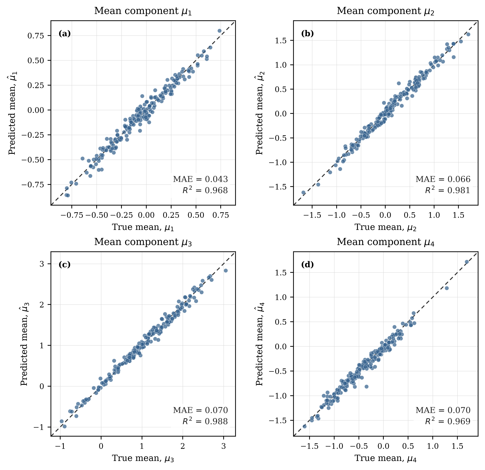
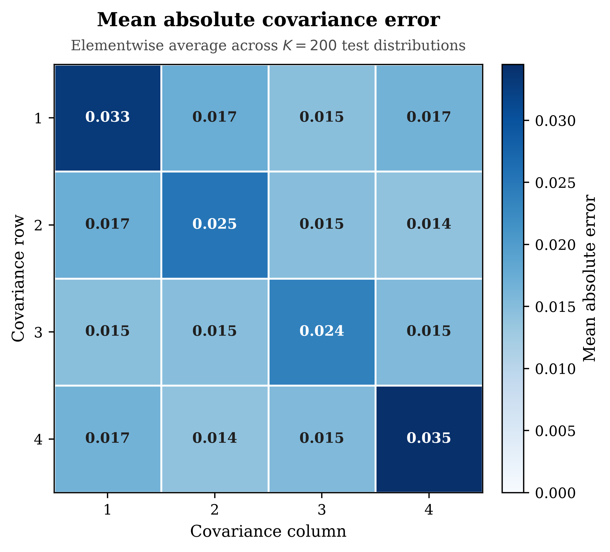
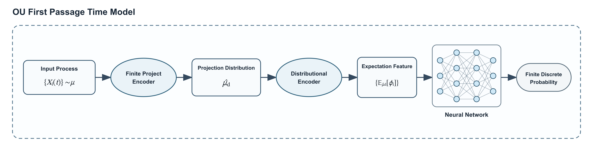
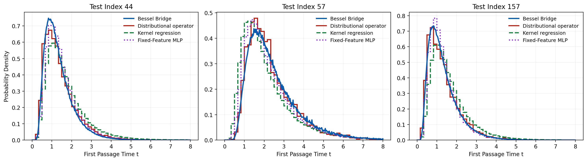
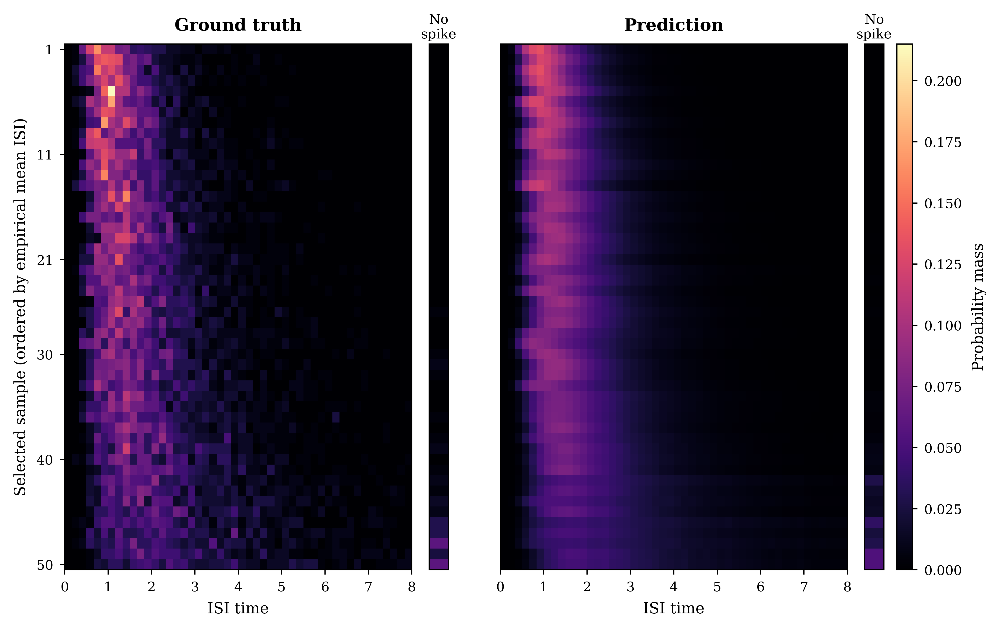
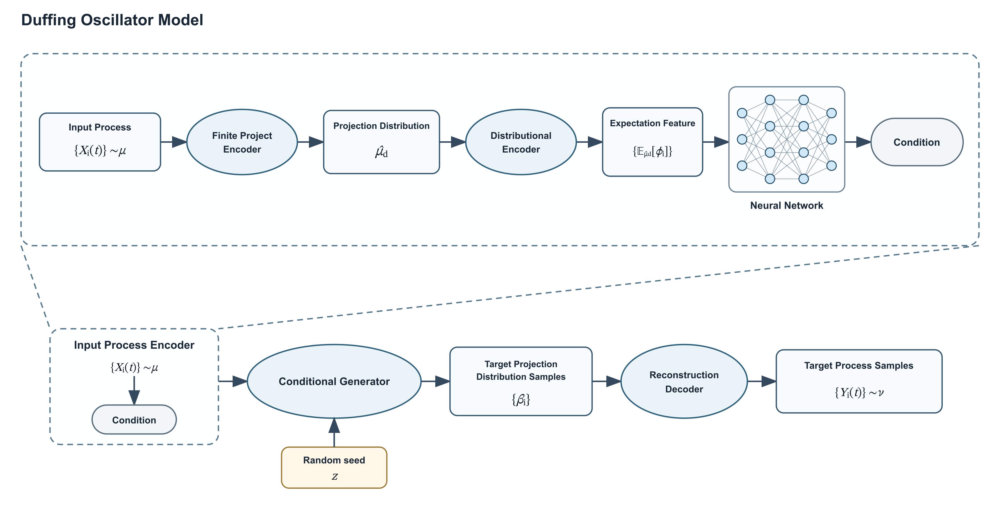
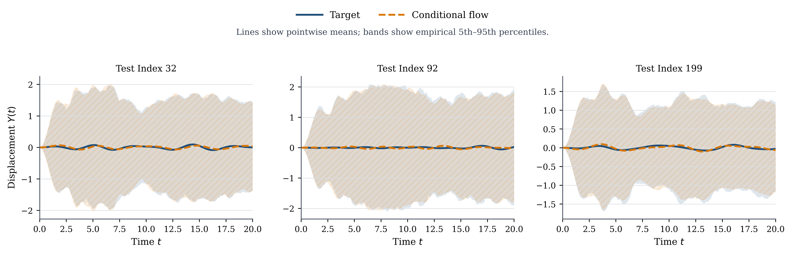

# Distributional Operator Experiments

This repository studies **distribution-to-distribution learning**: learning an
operator that maps samples from an input probability law to a representation
or samples of an output law. The experiments cover finite-dimensional Gaussian
laws, first-passage-time distributions, and stochastic Duffing-oscillator
trajectories.

## Experiments at a glance

| Experiment | Input | Predicted output | Main evaluation views |
| --- | --- | --- | --- |
| [`gaussian_law_exp/`](gaussian_law_exp/) | Samples from a finite-dimensional Gaussian-mixture law | Mean and full covariance of a Gaussian law | Mean-component agreement and covariance error |
| [`isi_exp/`](isi_exp/) | Samples of stochastic input-process paths | Discrete inter-spike-interval (ISI) / first-passage-time law | Density curves and target-versus-prediction heatmaps |
| [`duffing_exp/`](duffing_exp/) | Samples of input trajectories | Conditional distribution of Duffing-oscillator response trajectories | Pointwise means and quantile envelopes |

Each experiment is self-contained and has its own configurations, scripts,
dependencies, and detailed README:

- [Gaussian law experiment](gaussian_law_exp/README.md)
- [ISI experiment](isi_exp/README.md)
- [Duffing oscillator experiment](duffing_exp/README.md)

## General approach

The common modeling pattern is to encode an unordered empirical input law into
a permutation-invariant expectation feature and use that feature to
parameterize an output distribution. Depending on the problem, the output is
represented by Gaussian parameters, categorical probability masses, or a
conditional generator in a reduced trajectory space. Moment-based neural
models and kernel regression are included as comparison methods.

## Gaussian law experiment

The finite-dimensional experiment maps particles from an input Gaussian
mixture to the mean and positive-definite full covariance of a target Gaussian
law.



The held-out evaluation compares predicted and analytic mean components and
reports the elementwise mean absolute error of the covariance matrix across
200 test laws.

<table>
  <tr>
    <td width="50%"></td>
    <td width="50%"></td>
  </tr>
  <tr>
    <td align="center"><em>Predicted versus true output means.</em></td>
    <td align="center"><em>Mean absolute covariance error.</em></td>
  </tr>
</table>

See [`gaussian_law_exp/README.md`](gaussian_law_exp/README.md) for dataset
generation, configuration, training, seed sweeps, and evaluation commands.

## ISI first-passage-time experiment

The ISI experiment projects stochastic process paths into a finite-dimensional
representation, encodes their empirical distribution, and predicts a discrete
first-passage-time probability law.



The evaluation figures show representative predicted densities alongside the
target and baseline methods, followed by a broader comparison of ground-truth
and predicted probability masses ordered by empirical mean ISI.





See [`isi_exp/README.md`](isi_exp/README.md) for data preparation, the process
distribution operator, fixed-feature MLP and kernel-regression baselines, and
evaluation commands.

## Duffing oscillator experiment

The Duffing experiment maps a distribution of input processes to a conditional
distribution of response trajectories. The input law is compressed and
encoded into a condition; a stochastic conditional generator produces target
coefficients, which are decoded back into process samples.



The example evaluation compares target and predicted pointwise means and
empirical 5th–95th percentile envelopes for three held-out test cases.



See [`duffing_exp/README.md`](duffing_exp/README.md) for dataset generation,
model configurations, training, multi-seed runs, and plotting commands.

## Repository layout

```text
distributional_operator_exp/
├── gaussian_law_exp/   # Finite-dimensional Gaussian law prediction
├── isi_exp/            # ISI / first-passage-time law prediction
├── duffing_exp/        # Stochastic Duffing response prediction
├── figures/            # Architecture and evaluation figures used here
└── README.md
```

## Getting started

Enter the experiment directory you want to run and follow its README. The
Gaussian and ISI projects use independent `uv` environments; the Duffing
project documents its own project-local Python environment. Datasets,
checkpoints, and generated experiment outputs are intentionally kept within
the corresponding experiment rather than shared at the repository root.

Typical entry points inside each experiment are:

```text
configs/      experiment and model configurations
scripts/      dataset, training, evaluation, and plotting commands
src/models/   model implementations
src/training/ losses, validation, and training orchestration
```

For reproducible comparisons, use the documented configuration file and
random seed, preserve the train/validation/test split, and evaluate the saved
best checkpoint with the experiment-specific evaluation script.
